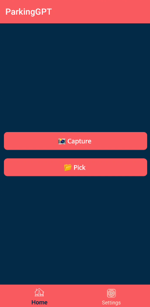
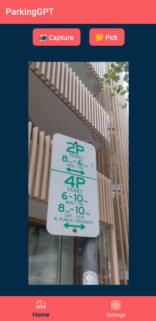
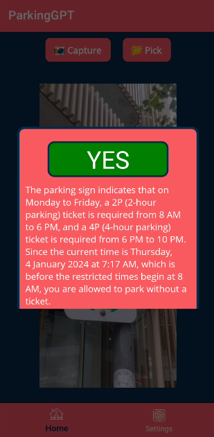

# ParkingGPT - Your AI Parking Copilot

    

[ParkingGPT](https://github.com/arafattehsin/ParkingGPT) is a cross-platform app that enables you to decide whether you want to park or not, all using the power of Vision AI & LLM. 

The app is built using .NET MAUI and it is powered by both OpenAI and Azure OpenAI. 

> ⚠️ Azure OpenAI SDK for .NET has [an issue](https://github.com/Azure/azure-sdk-for-net/issues/40855) going-on to support more than 64 KB images for GPT-4 for Vision. Therefore, it is only going to work with OpenAI API for now. 

  ## Getting Started ##

* [Install .NET MAUI](https://dot.net/maui) and refer to the [.NET MAUI Documentation](https://docs.microsoft.com/dotnet/maui)
* Secure [OpenAI API](https://openai.com/blog/openai-api) or [Azure OpenAI Service](https://learn.microsoft.com/en-us/legal/cognitive-services/openai/limited-access) subscription
* The development style has been kept according to this [Development Guide](https://github.com/dotnet/maui/blob/main/.github/DEVELOPMENT.md) so that best practices are followed. 
  

## Overview

**ParkingGPT** is a cross-platform app that uses the power of GPT 4 Turbo for Vision to help you decide whether you want to park or not. With ParkingGPT, you can easily identify parking signs and make informed decisions about where to park. This app has a feature to directly use your phone's camera or you can upload a picture of a parking sign. Whether you’re a driver looking for a convenient parking spot or a parking enforcement officer looking to enforce parking regulations, ParkingGPT is your AI parking copilot.

  

## In-progress features

- Support for multiple parking signs (no parking, no stopping, special assistance etc.)
  

## FAQs

**Is it published on a Google Play Store?** 
- No, but you can get the .apk package and sideload it to your Android for now. If there's much interest, I can think of publishing it to the store.

**Is it published on an Apple App Store?**
- No. I do not own a Macbook which restricts me from creating a package (or .ipa) for this app. The developer program subscription is too expensive for a hobbyist. 

**Does it work seamlessly with multiple parking signs?** 
- I have tried 2 to 3 ones and it works fine. However, I am not sure how it would react to the more than 2 or 3 signs. *I am still testing it.*

**Is it smart enough to make decision based upon the no parking signs and parking signs?** 
- Not for now. I will see this for future.
  

## How to Engage, Contribute and Give Feedback

You can contribute to this repo with issues and pull requests (PRs). Simply filing issues for problems you encounter is a great way to contribute. Contributing code is greatly appreciated.

Special shoutout to [Simon Waight](https://github.com/sjwaight) for bringing up this [idea with me](https://twitter.com/simonwaight/status/1630787390393704448). Soon, you will be able to read a blog post on its background, failures and much more :)

## License

This repository is licensed with the [MIT license](LICENSE.md).
